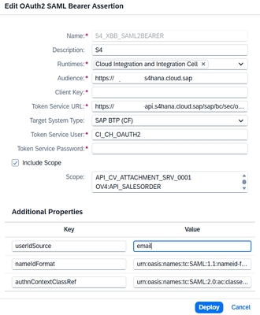

# Getting Started

It contains these folders and files, following our recommended project layout:

File or Folder | Purpose
---------|----------
`srv/` | your service models and code go here
`readme.md` | this getting started guide

## Project Setup Commands

Commands used to set up and evolve this project:

```sh
cds init
cds add ias
cds add ams
cds add typescript
cds add mta
npm install
```

## Build

```sh
mbt build
```

## Deploy

```sh
cf deploy mta_archives/cap-s4-iflow_1.0.0.mtar
```

## For setting up SAML2BearerAssertion in Cloud Integration consuming the S/4HANA Public Cloud API

<br>

Property | Value
--- | ---
Audience | From Communication Arrangement
Client Key | From Communication User
Token Service URL | From Communication Arrangement
Target System | SAP BTP (CF)
Token Service User | From communication User
Scope | From Communication Arrangement
userIdSource (Additional Properties) | email
nameIdFormat (Additional Properties) | urn:oasis:names:tc:SAML:1.1:nameid-format:emailAddress
authnContextClassRef (Additional Properties) | urn:oasis:names:tc:SAML:2.0:ac:classes:X509

## Learn More

Learn more at <https://cap.cloud.sap>.
